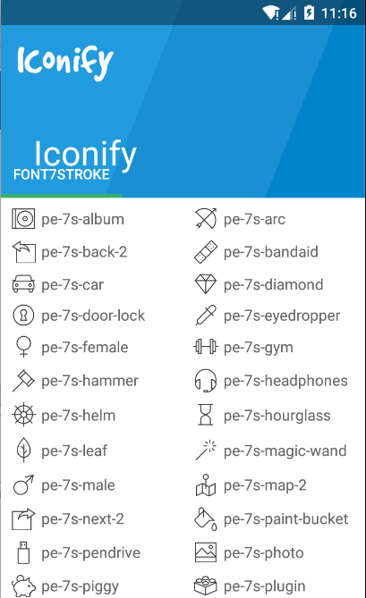

Intergrate [Android-Iconify](https://github.com/JoanZapata/android-iconify) with [Font 7 Stroke icon font](http://themes-pixeden.com/font-demos/7-stroke/).

-----

### Install

Declare your dependency.

```gradle
dependencies {
    compile 'com.joanzapata.iconify:android-iconify:2.1.1'
    compile 'com.loyalsound:android-iconify-font-7-stroke:0.0.1'
}
```

```java
public class MyApplication extends Application {

    @Override
    public void onCreate() {
        super.onCreate();
        Iconify
            .with(new Font7StrokeModule());
    }
}
```

### USAGE

[See original author guide](https://github.com/JoanZapata/android-iconify)



-----

## Contributions

* Thanh Nguyen [@9you](https://github.com/9you)

## Credit

Thanks [@JoanZapata](https://github.com/JoanZapata) for great lib

## License

```
Copyright 2015 Thanh Nguyen

Licensed under the Apache License, Version 2.0 (the "License");
you may not use this file except in compliance with the License.
You may obtain a copy of the License at

    http://www.apache.org/licenses/LICENSE-2.0

Unless required by applicable law or agreed to in writing, software
distributed under the License is distributed on an "AS IS" BASIS,
WITHOUT WARRANTIES OR CONDITIONS OF ANY KIND, either express or implied.
See the License for the specific language governing permissions and
limitations under the License.

It uses Font 7 Stroke font by Pixeden.

---------------------------------------------
Find more great resources @ Pixeden.com
Sincerely,
The Pixeden Team.
---------------------------------------------
http://www.pixeden.com
    
```
